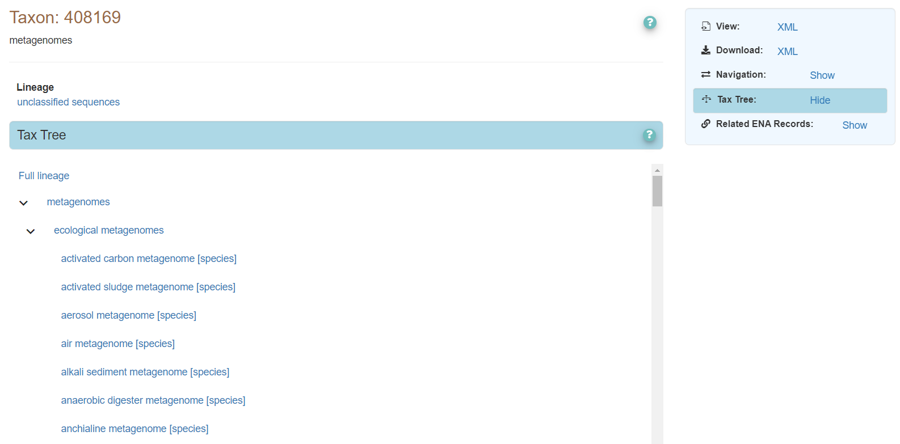

# Tips for Sample Taxonomy

The classification system for source biological organisms for all INSDC records is the NCBI Taxonomy and 
is available from the . The ENA team work 
alongside taxonomists at the NCBI to ensure that all ENA records display the accepted organism name and 
classification hierarchy. NCBI Taxonomy covers the complete tree of life and also includes other types, 
such as synthetic constructs and environmental samples. However, it is an incomplete classification system 
in that it only considers taxa for data that are represented in INSDC records. Users should note that taxa 
are only displayed if at least one associated ENA record is available.

## Choosing the Right Taxonomy For Your Submission

Submitted organism names must be at ‘species’ rank. This rank type does not automatically mean the name 
is a published binomen; it is simply a rank, which differentiates the sequenced organism from another. 
For example, unidentified strains of the same bacterial genus should be kept as separate species, 
rather than binned together under the same genus name.

If you do not know the scientific name or the common name that you would like to use for your submission but you 
have an idea, you can use this *suggest* endpoint for the ENA taxonomy service:
 
 `http://www.ebi.ac.uk/ena/data/taxonomy/v1/taxon/suggest-for-submission/`

For example, using curl or pasting the URL in the browser for "curry" looks as follows:

```bash
> curl "http://www.ebi.ac.uk/ena/data/taxonomy/v1/taxon/suggest-for-submission/curry"
[
  {
    "taxId": "159030",
    "scientificName": "Murraya koenigii",
    "displayName": "curry leaf"
  },
  {
    "taxId": "261786",
    "scientificName": "Helichrysum italicum",
    "displayName": "curry plant"
  }
]
```

### Checking a taxon is submittable

If you know the taxon you would like to use, you can check if its submittable and find any additional information 
 about it by using this url:

`https://www.ebi.ac.uk/ena/data/taxonomy/v1/taxon/scientific-name/`

For example, using curl or pasting the url in the browser for "mixed culture" looks as follows:

```bash
> curl "https://www.ebi.ac.uk/ena/data/taxonomy/v1/taxon/scientific-name/mixed%20culture"
[
  {
    "taxId": "1306155",
    "scientificName": "mixed culture",
    "formalName": "false",
    "rank": "no rank",
    "division": "UNC",
    "lineage": "unclassified sequences; ",
    "geneticCode": "1",
    "mitochondrialGeneticCode": "2",
    "plastIdGeneticCode": "11",
    "submittable": "false"
  }
]
```

Please see our  for more advice on exploring our 
taxonomy services.


## Environmental Taxonomic Classifications

### Environmental Biome-Level Taxonomy

Every sample object in ENA must have a taxonomic classification assigned to it. Environmental samples can not be described with a single organism identifier because they represent an environment with an unknown variety and number of organisms.

For this purpose there are entries in the Tax Database that apply exclusively to environmental samples. Taxa of this type can be immediately identified as they contain the term "metagenome" as part of the scientific name. These are searchable within the Tax Database using the same methods described above.

```bash
curl "www.ebi.ac.uk/ena/data/taxonomy/v1/taxon/suggest-for-submission/marsupial%20meta"
[
  {
    "taxId": "1477400",
    "scientificName": "marsupial metagenome",
    "displayName": "marsupial metagenome"
  }
```

To view all environmental taxonomy available please visit [ENA tax portal](https://www.ebi.ac.uk/ena/data/view/Taxon:408169). Click on the *Tax tree* tab and click the '+' icons to expand the categories:



 The metagenomic term that is used to describe the biome is also the scientific name of the chosen taxon and can be used to find the tax ID in the same methods described above. For example, you can find the tax ID for *termite fungus garden metagenome* here:
 `http://www.ebi.ac.uk/ena/data/taxonomy/v1/taxon/scientific-name/termite fungus garden metagenome`.

 Please note that new metagenome taxonomic records are rarely added, particularly those that add granularity. Please use the closest available choice, even if this is a less granular option. Only request a new term if you are sure you are unable to use anything in the lists available.

### Environmental Organism-Level Taxonomy

If you are submitting sequences or assemblies that have been identified taxonomically from homology alone, with no culturing or isolation of the organism beforehand, then we also consider these as environmental samples. These samples should be registered with uncultured taxonomy to make it clear they were derived from an environmental source.

A typical use-case of this would be the submission of a single fully assembled genome from a mixed DNA sample (i.e., from a metagenomic source).  There are exceptions where this taxonomy should not be used: for example, organisms which can be reliably recovered from their diseased host (e.g., endosymbionts, phytoplasmas) and organisms from samples which are readily identifiable by other means (e.g., cyanobacteria); organisms such as these are not considered uncultured/environmental in the way described here. If you are unsure whether your sample should be registered as environmental, contact our [helpdesk](https://www.ebi.ac.uk/ena/browser/support) for assistance.

Environmental organism-level taxa are usually prefixed with the term uncultured and are not allowed to have a species epithet. Some examples of basic organism names that can be used include:

- *uncultured bacterium  (taxid:77133)*
- *uncultured archaeon  (taxid:115547)*
- *uncultured cyanobacterium  (taxid:1211)*
- *uncultured prokaryote  (taxid:198431)*
- *uncultured fungus  (taxid:175245)*
- *uncultured eukaryote  (taxid:100272)*

Where possible, you should register your samples with the most granular identification possible, up to Genus level. For example, for prokaryotes, the format is:

uncultured \<Rank\> sp.

*e.g. uncultured Bacillus sp.*

 For Fungi, the ‘sp.’ is dropped:

uncultured \<Rank\>

*e.g., uncultured Glomus*

When registering samples that use uncultured taxonomy, a general environmental record should also be registered to describe the biome that was originally sequenced. This biome-level environmental sample should also be referenced within the organism-level sample using the "sample derived from" attribute.
