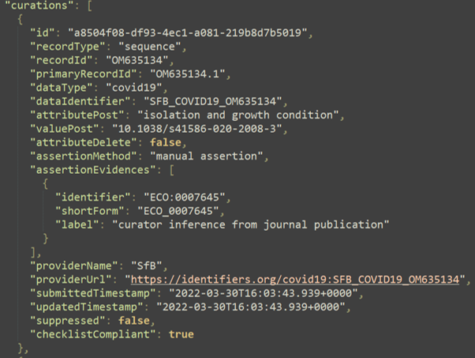
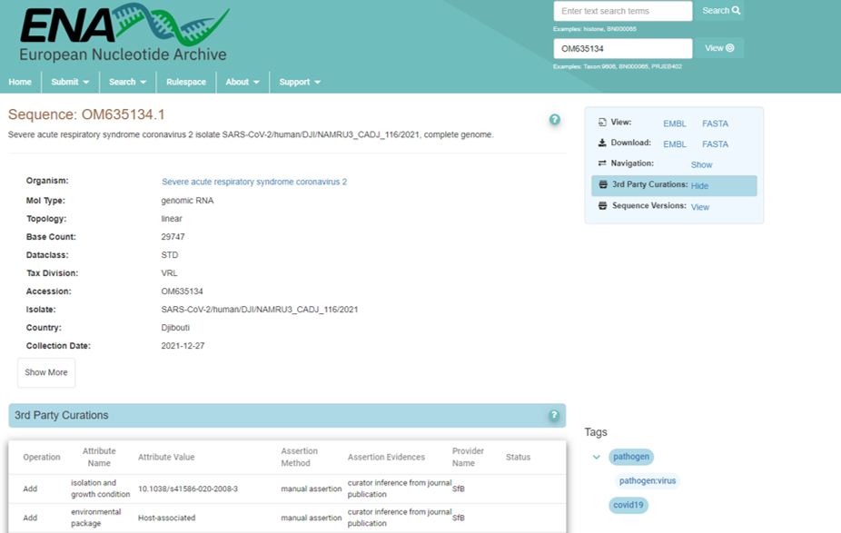

# Clearinghouse for ENA Users

<!-- TOC -->
* [Clearinghouse for ENA Users](#clearinghouse-for-ena-users)
  * [Purpose of this document](#purpose-of-this-document)
  * [Introduction](#introduction)
    * [Further Reading](#further-reading)
    * [The Relevancy to ENA](#the-relevancy-to-ena)
  * [Example use cases](#example-use-cases)
  * [Making use of the Extra Annotation in Clearinghouse](#making-use-of-the-extra-annotation-in-clearinghouse)
  * [Programmatic Querying of Clearinghouse](#programmatic-querying-of-clearinghouse)
  * [How is using the Clearinghouse Different from Updating Records in ENA/Biosamples?](#how-is-using-the-clearinghouse-different-from-updating-records-in-enabiosamples-)
  * [The Link between Biosamples & ENA](#the-link-between-biosamples--ena)
  * [Appendix:](#appendix)
    * [1. A template bash script for submission](#1-a-template-bash-script-for-submission)
<!-- TOC -->

## Purpose of this document
This document's purpose is to provide additional information about the ELIXIR Clearinghouse, to make it easier for ENA (and non-ENA) users to submit data to it. 
 
 
It is a supplement to the API document [here](https://docs.google.com/document/d/1y1a4xQwCddntDkmY3qq1XvxtMUZAtW0h3RhEMo3Gtho/edit#heading=h.1ksv4uv), which contains more technical information regarding usage of the Clearinghouse API, so please ensure you read both before starting. The API document is the source of truth and will be more frequently updated than this one.    

## Introduction
The ELIXIR Clearinghouse enables extension, correction and improvement of publicly available annotations on sample, sequence, run/experiment and study records available in the European Nucleotide Archive (ENA) (and by extension, as the wider International Nucleotide Sequence Database Collaboration (INSDC) databases). The overall aim is to make metadata more FAIR and improve its quality.

Curations submitted to Clearinghouse will present alongside the record, **without the original archived metadata being changed**. This allows the scientific community to enhance existing metadata records, for example to add information gleaned from paper supplements, or propose improved attributes that previously did not conform to standards/ontologies, without modifying the original record (often) submitted by a different user.

### Background
The Clearinghouse was developed as part of an ELIXIR project to:
- strengthen collaborations between ELIXIR resources
- improve the quality and impact of metadata, and
- build more sustainable data resources
It was initially developed to support records in the marine domain, but has since expanded to cover multiple project types, see below.
For more information please see https://elixir-europe.org/internal-projects/commissioned-services/establishment-data-clearinghouse

### The Relevancy to ENA
The Clearinghouse is deliberately set up to allow submission of new or updated metadata (related to INSDC records) originating from different sources. ENA staff have been amongst the most enthusiastic users and annotators, but have also supported other groups to submit these metadata curations. Wider enthusiasm is also growing.

 
## Example use cases
| Project                             | Clearinghouse usage                                                                                                                                                                                                                                                    | ENA members involved  | External groups involved              |
|-------------------------------------|------------------------------------------------------------------------------------------------------------------------------------------------------------------------------------------------------------------------------------------------------------------------|-----------------------|---------------------------------------|
| BY-COVID (beyond-COVID)                            | <ul><li>27,566,814 SARS-CoV-2 curations pushed through by UiT <li>appropriate curations presenting alongside records in ENA Browser </ul>                                                                                                           | Zahra Waheed, Nadim Rahman          | The Arctic University of Norway (UiT) |
| 
BlueCloud
 | <ul><li>Extra metadata around geographical determination (using GPS and taxonomy) and from GPS  <li>e.g.  EEZ and high sea<li>0.5 million records curated</ul>                                                                                                       | Peter Woollard, Stéphane Pesant, Lili Meszaros | WoRMS                                 |
| BiCIKL                              | <ul><li>Expanding on metadata available mostly for sequences  <li>Updating taxonomic identifications of sequence data, deriving from the Unite pipelines</li>  <li>Potential for further updates (e.g. specimen voucher info) coming from other groups (e.g. Museums)</ul> | Joana Pauperio                | PlutoF                                |
| MGnify                              | <li>Expanding on metadata from literature - assignment of biomes via machine learning? TBC                                                                                                                                                                                      | Josephine Burgin                |                                       |
| DToL (Darwin Tree of Life Project)                                   | <li>None yet - considering using Clearinghouse to add quality scores to assemblies                                                                                                                                                                                                 | Josephine Burgin, Joana Pauperio          | Sanger                                |

 

## Curation objects
### Examples
Curations associated to an ENA Sample, Study, Run/Experiment and Sequence can be submitted to Clearinghouse. Below are some examples from different projects.
#### *Marine Metagenome Sample Curation:*

 
#### *SARS-CoV-2 Sequence Curation:*

 
 
### What happens to curations after submission to Clearinghouse?

For all public ENA/INSDC records, curations associated to them will automatically become visible alongside the record in the ENA browser, as below:

#### *Marine Metagenome Sample Curation:*

 
 
For **any** sample related metadata curations, cases where both attribute name and value have been validated to be compliant with ENA Checklist fields will take priority for display, and appear at the top of the 3rd Party Curations table in the browser. See below:

#### *SARS-CoV-2 Sequence Curation:*

## Tips for programmatically querying Clearinghouse data 

The Swagger API to the Clearinghouse ([here](https://www.ebi.ac.uk/ena/clearinghouse/api/swagger-ui/index.html#/)) allows one to do many types of query programmatically in production and [development](https://wwwdev.ebi.ac.uk/ena/clearinghouse/api/swagger-ui/index.html#/). This includes adding, modifying and removing curations, as well as querying the existing metadata in Clearinghouse, eg:
- querying via the ENA Sample ID (SAMEA####) - also known as 'recordID' to view all metadata curations associated to that sample
- querying all records submitted by a particular group ('providerName')

No account is needed for read access of the Clearinghouse API. 
For more technical information on queries please refer to the [API documentation](https://docs.google.com/document/d/1y1a4xQwCddntDkmY3qq1XvxtMUZAtW0h3RhEMo3Gtho/edit#heading=h.1ksv4uv).
 
 
You may find it useful to first obtain ENA accessions for Clearinghouse queries via the ENA's own [Advanced Search API](https://docs.google.com/document/d/1CwoY84MuZ3SdKYocqssumghBF88PWxUZ/edit) or [browser based Advanced Search](https://www.ebi.ac.uk/ena/browser/advanced-search).

Currently more complex querying would require you to process the JSON output with the allowable queries.

Think carefully about what you want to do and why. Also decide which ENA record object do you wish to annotate, to date much of the extra annotations have been to the bio-sample id.

Essentially:
* Register for either an AAP or LifeScience ID, if you do not already have one. We suggest that you obtain credentials for both test and production
* Generate a bearer token 
* For some test records generate JSON conforming to the Clearinghouse JSON format 
* Test submit these to the test instance of the Clearinghouse 
* Explore retrieving these from the test instance of the Clearinghouse 
* Generate JSON annotations conforming to the Clearinghouse JSON format for all the records:
* Submit these to the production instance of the Clearinghouse 
* Log and examine the logs for an error and resubmit if necessary. (tip: in my submission scripts,  the small percentage of failures were timeouts, so I did a try/exception, wait and retry automatically in the submission scripts.)
* Examine retrieving a selection of those from the production instance of the Clearinghouse

## How is using the Clearinghouse Different from Updating Records in ENA?

It is important to differentiate between the curations submitted via the ELIXIR Clearinghouse and ENA-based metadata updates. 

* An ENA record update modifies the original public record, while a curation submitted to the Clearinghouse presents alongside the original record instead
* Only the original submitter of an ENA record can update this directly, while curations for a particular record can be submitted to the Clearinghouse by *any user* (as long as sufficient evidence is provided for how that curation was generated)
* An ENA record update requires Webin authentication, while curation submission/modification requires either AAP or LifeScience ID authentication instead
* As ENA record updates modify the original record, the modifications will propagate to EBI-based data portals (such as the Pathogens Portal, Early Cause, COVID-19 Data Portal) and be exchanged with other INSDC nodes. Curations submitted via Clearinghouse only present in the ENA browser and do not feed into other INSDC sites nor data portals.

## Appendix:
### 1. [A template bash script for submission](clearinghouse_submission_template.sh)

